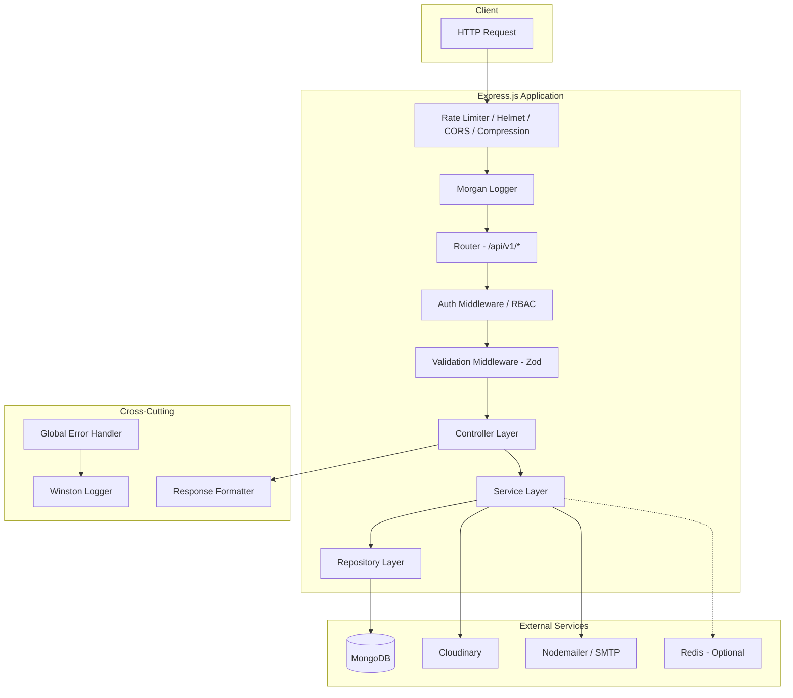
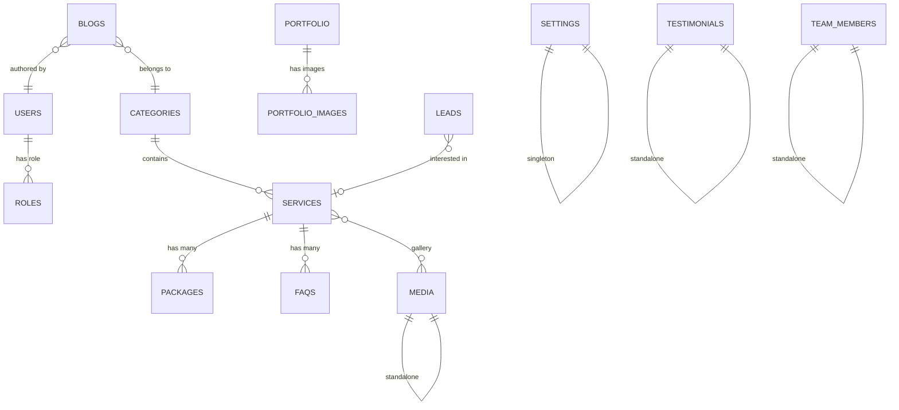

# ParaSiteMedia — Production-Ready Backend Implementation Plan

## Overview

A production-ready **Agency Management System** backend built with Node.js, Express.js, MongoDB, and a clean layered architecture (Controller → Service → Repository). The system manages services, portfolios, blogs, team members, leads, media, and website settings for a digital agency.

> [!IMPORTANT]
> This is a **large project** (~80+ files). The plan is organized into **8 sequential phases**, each building on the previous. I will implement each phase fully, wait for your confirmation, then proceed.

---

## Architecture Diagram



---

## Database Schema Relationships



---

## Proposed Folder Structure

```
Server/
├── .env.example
├── .gitignore
├── package.json
├── swagger.js
├── src/
│   ├── app.js                          # Express app setup (middleware, routes)
│   ├── server.js                       # HTTP server bootstrap + graceful shutdown
│   ├── config/
│   │   ├── index.js                    # Central config loader (dotenv → validated object)
│   │   ├── database.js                 # MongoDB connection
│   │   ├── cloudinary.js               # Cloudinary SDK setup
│   │   ├── redis.js                    # Redis client (optional)
│   │   └── nodemailer.js               # SMTP transporter
│   ├── constants/
│   │   ├── index.js                    # Barrel export
│   │   ├── httpStatus.js               # HTTP status code constants
│   │   ├── messages.js                 # User-facing message strings
│   │   ├── roles.js                    # Role enums
│   │   └── enums.js                    # Shared enums (status, package types, etc.)
│   ├── database/
│   │   └── seeds/
│   │       ├── roleSeeder.js           # Seed default roles
│   │       └── adminSeeder.js          # Seed super admin user
│   ├── models/
│   │   ├── index.js
│   │   ├── User.model.js
│   │   ├── Role.model.js
│   │   ├── Category.model.js
│   │   ├── Service.model.js
│   │   ├── Package.model.js
│   │   ├── Faq.model.js
│   │   ├── Portfolio.model.js
│   │   ├── PortfolioImage.model.js
│   │   ├── Blog.model.js
│   │   ├── Testimonial.model.js
│   │   ├── TeamMember.model.js
│   │   ├── Lead.model.js
│   │   ├── Media.model.js
│   │   └── Setting.model.js
│   ├── repositories/
│   │   ├── base.repository.js          # Generic CRUD repository (DRY)
│   │   ├── user.repository.js
│   │   ├── role.repository.js
│   │   ├── category.repository.js
│   │   ├── service.repository.js
│   │   ├── package.repository.js
│   │   ├── faq.repository.js
│   │   ├── portfolio.repository.js
│   │   ├── portfolioImage.repository.js
│   │   ├── blog.repository.js
│   │   ├── testimonial.repository.js
│   │   ├── teamMember.repository.js
│   │   ├── lead.repository.js
│   │   ├── media.repository.js
│   │   └── setting.repository.js
│   ├── services/
│   │   ├── auth.service.js
│   │   ├── user.service.js
│   │   ├── category.service.js
│   │   ├── service.service.js
│   │   ├── package.service.js
│   │   ├── faq.service.js
│   │   ├── portfolio.service.js
│   │   ├── blog.service.js
│   │   ├── testimonial.service.js
│   │   ├── teamMember.service.js
│   │   ├── lead.service.js
│   │   ├── media.service.js
│   │   └── setting.service.js
│   ├── controllers/
│   │   ├── auth.controller.js
│   │   ├── user.controller.js
│   │   ├── category.controller.js
│   │   ├── service.controller.js
│   │   ├── package.controller.js
│   │   ├── faq.controller.js
│   │   ├── portfolio.controller.js
│   │   ├── blog.controller.js
│   │   ├── testimonial.controller.js
│   │   ├── teamMember.controller.js
│   │   ├── lead.controller.js
│   │   ├── media.controller.js
│   │   └── setting.controller.js
│   ├── routes/
│   │   ├── index.js                    # Route aggregator
│   │   ├── auth.routes.js
│   │   ├── user.routes.js
│   │   ├── category.routes.js
│   │   ├── service.routes.js
│   │   ├── package.routes.js
│   │   ├── faq.routes.js
│   │   ├── portfolio.routes.js
│   │   ├── blog.routes.js
│   │   ├── testimonial.routes.js
│   │   ├── teamMember.routes.js
│   │   ├── lead.routes.js
│   │   ├── media.routes.js
│   │   └── setting.routes.js
│   ├── validators/
│   │   ├── auth.validator.js
│   │   ├── user.validator.js
│   │   ├── category.validator.js
│   │   ├── service.validator.js
│   │   ├── package.validator.js
│   │   ├── faq.validator.js
│   │   ├── portfolio.validator.js
│   │   ├── blog.validator.js
│   │   ├── testimonial.validator.js
│   │   ├── teamMember.validator.js
│   │   ├── lead.validator.js
│   │   ├── media.validator.js
│   │   └── setting.validator.js
│   ├── middlewares/
│   │   ├── auth.middleware.js           # JWT verification
│   │   ├── rbac.middleware.js           # Role-based access control
│   │   ├── validate.middleware.js       # Zod schema runner
│   │   ├── upload.middleware.js         # Multer config
│   │   ├── rateLimiter.middleware.js    # Express rate limiter
│   │   ├── errorHandler.middleware.js   # Global error handler
│   │   └── notFound.middleware.js       # 404 handler
│   ├── utils/
│   │   ├── ApiError.js                  # Custom error class
│   │   ├── ApiResponse.js              # Standardized response wrapper
│   │   ├── asyncHandler.js             # Try/catch wrapper for async routes
│   │   ├── logger.js                    # Winston logger instance
│   │   ├── slugify.js                   # Slug generator
│   │   ├── pagination.js               # Pagination helper
│   │   └── queryBuilder.js             # Filter/sort/search query builder
│   ├── helpers/
│   │   ├── token.helper.js             # JWT sign/verify helpers
│   │   ├── password.helper.js          # bcrypt hash/compare
│   │   ├── cloudinary.helper.js        # Upload/delete from Cloudinary
│   │   └── email.helper.js             # Send email via Nodemailer
│   ├── emails/
│   │   └── templates/
│   │       ├── resetPassword.html
│   │       └── welcomeEmail.html
│   ├── uploads/                         # Temp Multer uploads (gitignored)
│   └── logs/                            # Winston log files (gitignored)
│       ├── error.log
│       ├── combined.log
│       └── exceptions.log
```

---

## Phased Implementation Plan

### Phase 1 — Foundation & Infrastructure
> Project scaffolding, configuration, database connection, logging, error handling, and response formatting.

| File | Description |
|------|-------------|
| `package.json` | All dependencies, scripts (`dev`, `start`, `seed`) |
| `.env.example` | Environment variable template |
| `.gitignore` | Standard Node.js gitignore |
| `src/config/index.js` | Central config with Zod validation |
| `src/config/database.js` | MongoDB connection with retry logic |
| `src/config/cloudinary.js` | Cloudinary SDK initialization |
| `src/config/nodemailer.js` | SMTP transporter factory |
| `src/utils/logger.js` | Winston logger (file + console transports) |
| `src/utils/ApiError.js` | Custom error class with status codes |
| `src/utils/ApiResponse.js` | Standardized JSON response wrapper |
| `src/utils/asyncHandler.js` | Async route wrapper |
| `src/utils/slugify.js` | URL-safe slug generator |
| `src/utils/pagination.js` | Pagination calculator |
| `src/utils/queryBuilder.js` | MongoDB filter/sort/search builder |
| `src/constants/*.js` | HTTP codes, messages, roles, enums |
| `src/helpers/password.helper.js` | bcrypt utilities |
| `src/helpers/token.helper.js` | JWT sign/verify/decode |
| `src/helpers/cloudinary.helper.js` | Cloudinary upload/delete |
| `src/helpers/email.helper.js` | Email sending with templates |
| `src/middlewares/errorHandler.middleware.js` | Global error handler |
| `src/middlewares/notFound.middleware.js` | 404 handler |
| `src/middlewares/validate.middleware.js` | Zod validation middleware |
| `src/middlewares/upload.middleware.js` | Multer configuration |
| `src/middlewares/rateLimiter.middleware.js` | Rate limiting |
| `src/repositories/base.repository.js` | Generic CRUD repository |
| `src/app.js` | Express app setup |
| `src/server.js` | Server bootstrap |
| `src/emails/templates/*.html` | Email HTML templates |

---

### Phase 2 — Authentication & User Management
> Users, Roles, JWT auth, refresh tokens, RBAC, password flows.

| File | Description |
|------|-------------|
| `src/models/Role.model.js` | Role schema (admin, manager, editor) |
| `src/models/User.model.js` | User schema with refresh token array |
| `src/repositories/role.repository.js` | Role data access |
| `src/repositories/user.repository.js` | User data access |
| `src/services/auth.service.js` | Login, logout, refresh, password flows |
| `src/services/user.service.js` | User CRUD |
| `src/controllers/auth.controller.js` | Auth endpoints |
| `src/controllers/user.controller.js` | User management endpoints |
| `src/validators/auth.validator.js` | Auth input validation schemas |
| `src/validators/user.validator.js` | User input validation schemas |
| `src/routes/auth.routes.js` | Auth routes |
| `src/routes/user.routes.js` | User management routes |
| `src/middlewares/auth.middleware.js` | JWT verification middleware |
| `src/middlewares/rbac.middleware.js` | Role-based access middleware |
| `src/database/seeds/roleSeeder.js` | Seed default roles |
| `src/database/seeds/adminSeeder.js` | Seed super admin |

---

### Phase 3 — Categories & Services
> Category CRUD, Service CRUD with relationships, slug generation.

| File | Description |
|------|-------------|
| `src/models/Category.model.js` | Category schema |
| `src/models/Service.model.js` | Service schema (refs Category) |
| `src/repositories/category.repository.js` | Category data access |
| `src/repositories/service.repository.js` | Service data access |
| `src/services/category.service.js` | Category business logic |
| `src/services/service.service.js` | Service business logic |
| `src/controllers/category.controller.js` | Category endpoints |
| `src/controllers/service.controller.js` | Service endpoints |
| `src/validators/category.validator.js` | Category validation |
| `src/validators/service.validator.js` | Service validation |
| `src/routes/category.routes.js` | Category routes |
| `src/routes/service.routes.js` | Service routes |

---

### Phase 4 — Packages & FAQs
> Package CRUD (tied to Services), FAQ CRUD (tied to Services).

| File | Description |
|------|-------------|
| `src/models/Package.model.js` | Package schema (refs Service) |
| `src/models/Faq.model.js` | FAQ schema (refs Service) |
| `src/repositories/package.repository.js` | Package data access |
| `src/repositories/faq.repository.js` | FAQ data access |
| `src/services/package.service.js` | Package business logic |
| `src/services/faq.service.js` | FAQ business logic |
| `src/controllers/package.controller.js` | Package endpoints |
| `src/controllers/faq.controller.js` | FAQ endpoints |
| `src/validators/package.validator.js` | Package validation |
| `src/validators/faq.validator.js` | FAQ validation |
| `src/routes/package.routes.js` | Package routes |
| `src/routes/faq.routes.js` | FAQ routes |

---

### Phase 5 — Portfolio & Blog
> Portfolio CRUD with images, Blog CRUD with rich content.

| File | Description |
|------|-------------|
| `src/models/Portfolio.model.js` | Portfolio schema |
| `src/models/PortfolioImage.model.js` | Portfolio image schema |
| `src/models/Blog.model.js` | Blog schema (refs Category, User) |
| `src/repositories/portfolio.repository.js` | Portfolio data access |
| `src/repositories/portfolioImage.repository.js` | Portfolio image data access |
| `src/repositories/blog.repository.js` | Blog data access |
| `src/services/portfolio.service.js` | Portfolio business logic |
| `src/services/blog.service.js` | Blog business logic |
| `src/controllers/portfolio.controller.js` | Portfolio endpoints |
| `src/controllers/blog.controller.js` | Blog endpoints |
| `src/validators/portfolio.validator.js` | Portfolio validation |
| `src/validators/blog.validator.js` | Blog validation |
| `src/routes/portfolio.routes.js` | Portfolio routes |
| `src/routes/blog.routes.js` | Blog routes |

---

### Phase 6 — Team, Testimonials & Leads
> Team member CRUD, Testimonial CRUD, Lead management.

| File | Description |
|------|-------------|
| `src/models/TeamMember.model.js` | Team member schema |
| `src/models/Testimonial.model.js` | Testimonial schema |
| `src/models/Lead.model.js` | Lead/contact schema |
| `src/repositories/teamMember.repository.js` | Team data access |
| `src/repositories/testimonial.repository.js` | Testimonial data access |
| `src/repositories/lead.repository.js` | Lead data access |
| `src/services/teamMember.service.js` | Team business logic |
| `src/services/testimonial.service.js` | Testimonial business logic |
| `src/services/lead.service.js` | Lead business logic |
| `src/controllers/teamMember.controller.js` | Team endpoints |
| `src/controllers/testimonial.controller.js` | Testimonial endpoints |
| `src/controllers/lead.controller.js` | Lead endpoints |
| `src/validators/teamMember.validator.js` | Team validation |
| `src/validators/testimonial.validator.js` | Testimonial validation |
| `src/validators/lead.validator.js` | Lead validation |
| `src/routes/teamMember.routes.js` | Team routes |
| `src/routes/testimonial.routes.js` | Testimonial routes |
| `src/routes/lead.routes.js` | Lead routes |

---

### Phase 7 — Media & Settings
> Cloudinary media management, singleton website settings.

| File | Description |
|------|-------------|
| `src/models/Media.model.js` | Media schema |
| `src/models/Setting.model.js` | Settings schema (singleton) |
| `src/repositories/media.repository.js` | Media data access |
| `src/repositories/setting.repository.js` | Settings data access |
| `src/services/media.service.js` | Media upload/delete logic |
| `src/services/setting.service.js` | Settings business logic |
| `src/controllers/media.controller.js` | Media endpoints |
| `src/controllers/setting.controller.js` | Settings endpoints |
| `src/validators/media.validator.js` | Media validation |
| `src/validators/setting.validator.js` | Settings validation |
| `src/routes/media.routes.js` | Media routes |
| `src/routes/setting.routes.js` | Settings routes |

---

### Phase 8 — Swagger Documentation, Route Assembly & Final Integration
> OpenAPI/Swagger docs, route index assembly, final testing.

| File | Description |
|------|-------------|
| `swagger.js` | Swagger/OpenAPI configuration |
| `src/routes/index.js` | Route aggregator (all modules) |
| Update `src/app.js` | Mount Swagger UI |

---

## Key Design Decisions

### 1. Base Repository Pattern
A generic `BaseRepository` class encapsulates all common CRUD, pagination, filtering, and soft-delete operations. Module-specific repositories extend it, adding only domain-specific queries. This eliminates ~80% of duplicated data-access code.

### 2. Refresh Token Strategy
Refresh tokens are stored in the User document as a **rotating array** (max 5 tokens). On login, a new pair is issued and the refresh token is set as an HTTP-only secure cookie. On refresh, the old token is replaced with a new one (rotation). This prevents token replay attacks.

### 3. Singleton Settings Pattern
The Settings collection uses `findOneAndUpdate` with `upsert: true`, ensuring exactly one settings document exists. No create/delete — only get and update.

### 4. Slug Generation
Auto-generated from title/name fields using a custom utility. Uniqueness is enforced at the database level with unique indexes, and the service layer appends a UUID suffix on collision.

### 5. Soft Delete
Implemented via an `isDeleted` boolean + `deletedAt` timestamp on models where data recovery matters (Services, Blogs, Portfolio). The base repository automatically filters out soft-deleted documents on all read queries.

### 6. Query Builder
A reusable `QueryBuilder` utility parses `?search=`, `?sort=`, `?filter[status]=`, `?page=`, `?limit=` query parameters into Mongoose-compatible query objects. Every list endpoint uses it.

---

## API Endpoint Summary

| Module | Endpoints | Auth Required |
|--------|-----------|---------------|
| **Auth** | `POST /login`, `POST /logout`, `POST /refresh-token`, `POST /forgot-password`, `POST /reset-password/:token`, `PUT /change-password` | Partial |
| **Users** | Full CRUD + profile | Admin only |
| **Categories** | Full CRUD | Admin/Manager |
| **Services** | Full CRUD + by slug + by category | Admin/Manager |
| **Packages** | Full CRUD (scoped to service) | Admin/Manager |
| **FAQs** | Full CRUD (scoped to service) | Admin/Manager |
| **Portfolio** | Full CRUD + manage images | Admin/Manager/Editor |
| **Blogs** | Full CRUD + by slug + publish/draft | Admin/Manager/Editor |
| **Team** | Full CRUD | Admin/Manager |
| **Testimonials** | Full CRUD | Admin/Manager |
| **Leads** | List, View, Update Status, Delete, Add Notes | Admin/Manager |
| **Media** | Upload, List, Search, Delete | Admin/Manager/Editor |
| **Settings** | Get, Update | Admin only |

---

## Verification Plan

### Automated Tests
```bash
# Lint check
npm run lint

# Start dev server and verify no crashes
npm run dev

# Seed database with default roles + admin
npm run seed
```

### Manual Verification
- Verify all routes load via Swagger UI at `/api-docs`
- Test auth flow (register → login → refresh → logout)
- Test CRUD operations on each module
- Verify role-based access control
- Verify file upload via Cloudinary
- Verify email sending for password reset

---

## Open Questions

> [!IMPORTANT]
> **1. MongoDB Connection String**: Will you provide your own MongoDB Atlas URI or should I configure it for a local MongoDB instance in `.env.example`? I'll default to a local instance placeholder.

> [!IMPORTANT]
> **2. Cloudinary Credentials**: The media module requires Cloudinary `cloud_name`, `api_key`, and `api_secret`. I'll add placeholders in `.env.example` — you'll need to fill in your own credentials.

> [!NOTE]
> **3. Redis**: The plan includes Redis as optional (for caching). I'll set it up so the app works without Redis but benefits from it when available. Is this acceptable?

> [!NOTE]
> **4. Email Templates**: I'll create basic but functional HTML email templates for password reset and welcome emails. You can customize them later.
